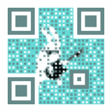

<p align="center">
  <a href="https://github.com/XiaoDaiGua-Ray/vue3-next-qrcode">
    
  </a>
</p>
<p align="center">
  <a href="https://www.npmjs.com/package/vue3-next-qrcode?activeTab=readme"></a>
  <a href="https://github.com/XiaoDaiGua-Ray/vue3-next-qrcode/blob/main/LICENSE"></a>
</p>

<div align="center">

# vue3-next-qrcode

English | [简体中文](https://github.com/XiaoDaiGua-Ray/vue3-next-qrcode/blob/main/README.zh-CN.md)

A powerful QR Code component for Vue 3 with rich features including LOGO, GIF backgrounds, and full SSR support!

</div>

## 🏄‍♀️ Example

<div style="display: flex;gap: 8px 12px;">
  
  
</div>

## ✨ Features

- 🏄🏼‍♂️ Easy to use with Vue 3 Composition API
- 🛸 Rich configuration properties
- 🏟️ Cover most business scenarios
- 🎯 Built with TypeScript, providing full type definition files
- 🚀 Support SSR (Nuxt 3, Nuxt 2)
- 🎨 Composable API (`useQRCode`)
- ♿ Accessibility support (ARIA labels, keyboard navigation)
- 🎭 GIF background with automatic caching
- 📦 Tree-shakable and optimized bundle size
- 🎨 Customizable styles with CSS variables
- � Autso-refresh on text changes
- 💾 Built-in download functionality

## 📦 Installation

```bash
# npm
npm install vue3-next-qrcode

# yarn
yarn add vue3-next-qrcode

# pnpm
pnpm add vue3-next-qrcode
```

## 🚀 Quick Start

### Basic Usage

```vue
<script setup lang="ts">
import { Vue3NextQrcode } from 'vue3-next-qrcode'
import 'vue3-next-qrcode/es/style.css'
</script>

<template>
  <Vue3NextQrcode text="https://github.com/XiaoDaiGua-Ray/vue3-next-qrcode" />
</template>
```

### With Custom Styles

```vue
<template>
  <Vue3NextQrcode
    text="Hello World"
    :size="300"
    :margin="20"
    colorDark="#000000"
    colorLight="#ffffff"
    :correctLevel="3"
  />
</template>
```

### With Logo

```vue
<template>
  <Vue3NextQrcode
    text="https://example.com"
    logoImage="https://example.com/logo.png"
    :logoScale="0.3"
    :logoMargin="10"
    :logoCornerRadius="8"
  />
</template>
```

### With GIF Background

```vue
<template>
  <Vue3NextQrcode
    text="Animated QR Code"
    :gifBackgroundURL="gifUrl"
    :dotScale="0.5"
    colorDark="#64d9d6"
  />
</template>

<script setup>
const gifUrl = 'https://example.com/background.gif'
</script>
```

### With Status (Loading/Error)

```vue
<template>
  <div>
    <!-- Loading state -->
    <Vue3NextQrcode text="Loading..." status="loading" />

    <!-- Error state -->
    <Vue3NextQrcode
      text="Error"
      status="error"
      errorDescription="QR code expired"
      errorActionDescription="Reload"
      :onReload="handleReload"
    />

    <!-- Custom loading slot -->
    <Vue3NextQrcode text="Custom Loading" status="loading">
      <template #loading>
        <div class="custom-spinner">Loading...</div>
      </template>
    </Vue3NextQrcode>

    <!-- Custom error action slot -->
    <Vue3NextQrcode text="Custom Error" status="error">
      <template #errorAction>
        <button @click="handleReload">Retry</button>
      </template>
    </Vue3NextQrcode>
  </div>
</template>

<script setup>
const handleReload = () => {
  console.log('Reloading...')
}
</script>
```

### Download QR Code

```vue
<template>
  <div>
    <Vue3NextQrcode ref="qrcodeRef" text="Download me!" />
    <button @click="handleDownload">Download QR Code</button>
  </div>
</template>

<script setup>
import { ref } from 'vue'

const qrcodeRef = ref()

const handleDownload = async () => {
  try {
    await qrcodeRef.value?.downloadQRCode('my-qrcode.png')
    console.log('Downloaded successfully!')
  } catch (error) {
    console.error('Download failed:', error)
  }
}
</script>
```

### With Callbacks

```vue
<template>
  <Vue3NextQrcode
    text="Callback Example"
    :onSuccess="handleSuccess"
    :onError="handleError"
  />
</template>

<script setup>
const handleSuccess = (dataURL) => {
  console.log('QR code generated:', dataURL)
}

const handleError = (error) => {
  console.error('Generation failed:', error)
}
</script>
```

## 🎨 Use with Composable API (v4.0.0+)

The `useQRCode` composable provides a flexible way to generate QR codes programmatically.

### Basic Example

```vue
<script setup lang="ts">
import { ref } from 'vue'
import { useQRCode } from 'vue3-next-qrcode'

const { qrcodeURL, isLoading, error, generate, clear } = useQRCode()

const text = ref('Hello World')

const handleGenerate = async () => {
  await generate({
    text: text.value,
    size: 300,
    margin: 20,
    colorDark: '#000000',
    colorLight: '#ffffff',
  })
}
</script>

<template>
  <div>
    <input v-model="text" placeholder="Enter text" />
    <button @click="handleGenerate" :disabled="isLoading">
      {{ isLoading ? 'Generating...' : 'Generate' }}
    </button>
    <button @click="clear">Clear</button>

    <div v-if="error" class="error">{{ error.message }}</div>
    
  </div>
</template>
```

### With GIF Background

```vue
<script setup lang="ts">
import { useQRCode } from 'vue3-next-qrcode'

const { qrcodeURL, generate } = useQRCode()

await generate({
  text: 'Animated QR',
  gifBackgroundURL: 'https://example.com/bg.gif',
  size: 400,
  dotScale: 0.5,
})
</script>

<template>
  
</template>
```

### API Reference

```typescript
interface UseQRCodeReturn {
  // The generated QR code (base64 string or ArrayBuffer)
  qrcodeURL: Ref<QRCodeRenderResponse>

  // Loading state
  isLoading: Ref<boolean>

  // Error state
  error: Ref<Error | null>

  // Generate QR code
  generate: (options: UseQRCodeOptions) => Promise<QRCodeRenderResponse>

  // Clear current QR code
  clear: () => void
}
```

## 🌐 SSR Support (Nuxt)

### Nuxt 3

#### Method 1: Use `ClientOnly` (Recommended)

```vue
<template>
  <ClientOnly>
    <QRCodeClient text="Hello Nuxt 3" />
    <template #fallback>
      <div>Loading QR Code...</div>
    </template>
  </ClientOnly>
</template>

<script setup>
import { QRCodeClient } from 'vue3-next-qrcode'
import 'vue3-next-qrcode/es/style.css'
</script>
```

#### Method 2: Dynamic Import

```vue
<template>
  <LazyQRCode v-if="mounted" text="Hello Nuxt" />
</template>

<script setup>
import { ref, onMounted } from 'vue'

const LazyQRCode = defineAsyncComponent(() =>
  import('vue3-next-qrcode').then((m) => m.Vue3NextQrcode),
)

const mounted = ref(false)

onMounted(() => {
  mounted.value = true
})
</script>
```

#### Method 3: Disable SSR for Specific Routes

```typescript
// nuxt.config.ts
export default defineNuxtConfig({
  routeRules: {
    '/qrcode': { ssr: false },
  },
})
```

### Nuxt Configuration

```typescript
// nuxt.config.ts
export default defineNuxtConfig({
  build: {
    transpile: ['vue3-next-qrcode'],
  },

  vite: {
    optimizeDeps: {
      include: ['vue3-next-qrcode'],
    },
  },
})
```

## 🎨 Custom Styles with CSS Variables

```vue
<template>
  <Vue3NextQrcode
    text="Styled QR Code"
    :defineProvider="{
      '--r-qrcode-primary-color': '#1677ff',
      '--r-qrcode-primary-color-2': '#69b1ff',
      '--r-qrcode-spin-size': '4px',
    }"
  />
</template>
```

### Available CSS Variables

```css
--r-qrcode-width           /* QR code width */
--r-qrcode-height          /* QR code height */
--r-qrcode-border-radius   /* Border radius */
--r-qrcode-mask-color      /* Mask overlay color */
--r-qrcode-primary-color   /* Primary theme color */
--r-qrcode-primary-color-2 /* Secondary theme color */
--r-qrcode-spin-size       /* Loading spinner size */
```

## 📝 TypeScript Support

Full TypeScript support with comprehensive type definitions:

```typescript
import type {
  QRCodeInst,
  QRCodeLevel,
  QRCodeStatus,
  QRCodeProps,
  QRCodeOptions,
  UseQRCodeOptions,
  UseQRCodeReturnType,
} from 'vue3-next-qrcode'

// Component instance type
const qrcodeRef = ref<QRCodeInst>()

// Error correction levels: 0 (L), 1 (M), 2 (Q), 3 (H)
const correctLevel: QRCodeLevel = 3

// Status type
const status: QRCodeStatus = 'loading' | 'error' | 'success'
```

## 📚 API Reference

### Component Props

| **name**               | **type**                                              | **default**      | **des**                                                                                                              | **version** |
| ---------------------- | ----------------------------------------------------- | ---------------- | -------------------------------------------------------------------------------------------------------------------- | ----------- |
| watchText              | boolean                                               | true             | Auto watch QR code text, If update text, then re-render QR code                                                      | \*          |
| status                 | QRCodeStatus                                          | undefined        | QR code status                                                                                                       | \*          |
| errorDescription       | string \| VNode                                       | 二维码已过期     | status error QR code error description label                                                                         | \*          |
| errorActionDescription | string                                                | 重新加载         | status error QR code error action description label                                                                  | \*          |
| text                   | string                                                | `required`       | Text to be encoded in the QR code                                                                                    | \*          |
| size                   | number                                                | 160              | Size of the QR code in pixel                                                                                         | \*          |
| margin                 | number                                                | 12               | Size of margins around the QR code body in pixel                                                                     | \*          |
| correctLevel           | number                                                | 1                | Error correction level of the QR code(0-3), Accepts a value provided by _QRErrorCorrectLevel_                        | \*          |
| maskPattern            | number                                                | undefined        | Specify the mask pattern to be used in QR code encoding, Accepts a value provided by _QRMaskPattern_                 | \*          |
| version                | number                                                | undefined        | Specify the version to be used in QR code encoding, Accepts an integer in range [1, 40]                              | \*          |
| components             | ComponentOptions                                      | {}               | Options to control components in the QR code                                                                         | \*          |
| colorDark              | string                                                | #000000          | Color of the blocks on the QR code                                                                                   | \*          |
| colorLight             | boolean                                               | #ffffff          | Color of the blocks on the QR code                                                                                   | \*          |
| autoColor              | boolean                                               | true             | Automatically calculate the _colorLight_ value from the QR code's background                                         | \*          |
| backgroundImage        | string                                                | undefined        | Background image to be used in the QR code                                                                           | \*          |
| backgroundDimming      | string                                                | rgba(0, 0, 0, 0) | Color of the dimming mask above the background image                                                                 | \*          |
| gifBackgroundURL       | string                                                | undefined        | GIF background image to be used in the QR code                                                                       | \*          |
| gifBackground          | ArrayBuffer                                           | undefined        | GIF background image to be used in the QR code                                                                       | \*          |
| whiteMargin            | boolean                                               | true             | Use a white margin instead of a transparent one which reveals the background of the QR code on margins               | \*          |
| logoImage              | string                                                | undefined        | Logo image to be displayed at the center of the QR code                                                              | \*          |
| logoScale              | number                                                | 0.4              | Ratio of the logo size to the QR code size                                                                           | \*          |
| logoMargin             | number                                                | 6                | Size of margins around the logo image in pixels                                                                      | \*          |
| logoCornerRadius       | number                                                | 8                | Corner radius of the logo image in pixels                                                                            | \*          |
| dotScale               | number                                                | 1                | Ratio of the real size to the full size of the blocks                                                                | \*          |
| onSuccess              | (dataURL: ArrayBuffer \| string \| undefined) => void | null             | When the QR code is successfully generated, this callback is called                                                  | \*          |
| onError                | (e: unknown) => void                                  | null             | When the QR code generation fails, this callback is called                                                           | \*          |
| onReload               | () => void                                            | null             | When reload button is clicked, this callback is called, This method will not execute if the errorAction slot is used | \*          |

### Slots

| **name**    | **params** | **description**                            | **version** |
| ----------- | ---------- | ------------------------------------------ | ----------- |
| errorAction | ()         | Custom display style in status error state | \*          |
| loading     | ()         | Customize loading status slots             | 2.0.4       |

### Component Instance Methods

```typescript
interface QRCodeInst {
  // Download the generated QR code
  downloadQRCode: (fileName?: string) => Promise<void>
}
```

### useQRCode Composable

```typescript
function useQRCode(): {
  qrcodeURL: Ref<QRCodeRenderResponse>
  isLoading: Ref<boolean>
  error: Ref<Error | null>
  generate: (options: UseQRCodeOptions) => Promise<QRCodeRenderResponse>
  clear: () => void
}
```

## 🎯 Advanced Examples

### Dynamic QR Code with Auto-refresh

```vue
<template>
  <div>
    <input v-model="url" placeholder="Enter URL" />
    <Vue3NextQrcode :text="url" :watchText="true" />
  </div>
</template>

<script setup>
import { ref } from 'vue'

const url = ref('https://example.com')
// QR code will auto-update when url changes
</script>
```

### Multiple QR Codes with Different Styles

```vue
<template>
  <div class="qrcode-grid">
    <Vue3NextQrcode
      v-for="item in qrcodes"
      :key="item.id"
      :text="item.text"
      :colorDark="item.color"
      :size="200"
    />
  </div>
</template>

<script setup>
const qrcodes = [
  { id: 1, text: 'Red QR', color: '#ff0000' },
  { id: 2, text: 'Green QR', color: '#00ff00' },
  { id: 3, text: 'Blue QR', color: '#0000ff' },
]
</script>
```

### Conditional Rendering Based on Status

```vue
<template>
  <Vue3NextQrcode
    :text="qrText"
    :status="qrStatus"
    :onSuccess="handleSuccess"
    :onError="handleError"
  />
</template>

<script setup>
import { ref } from 'vue'

const qrText = ref('Loading...')
const qrStatus = ref('loading')

setTimeout(() => {
  qrText.value = 'https://example.com'
  qrStatus.value = undefined
}, 2000)

const handleSuccess = (dataURL) => {
  console.log('Generated:', dataURL)
}

const handleError = (error) => {
  qrStatus.value = 'error'
  console.error(error)
}
</script>
```

## 🔧 Migration Guide

### From v3.x to v4.0.0

**Breaking Changes:**

1. CSS class prefix changed from `ray-qrcode` to `r-qrcode`
2. `img_tag` attribute changed to `data-component`

**New Features:**

1. `useQRCode` composable
2. `QRCodeClient` for SSR
3. GIF caching mechanism
4. Better TypeScript support

**Migration Steps:**

```vue
<!-- Before (v3.x) -->
<template>
  <Vue3NextQrcode text="hello" gif-background-url="..." />
</template>

<!-- After (v4.0.0) -->
<template>
  <Vue3NextQrcode text="hello" :gifBackgroundURL="..." />
</template>
```

```css
/* Before (v3.x) */
.ray-qrcode {
}

/* After (v4.0.0) */
.r-qrcode {
}
```

## ❓ FAQ

### Q: How to use in Nuxt?

A: Use `<ClientOnly>` wrapper or `QRCodeClient` component. See [SSR Support](#-ssr-support-nuxt) section.

### Q: How to download QR code?

A: Use the `downloadQRCode` method from component ref. See [Download QR Code](#download-qr-code) example.

### Q: Can I use GIF as background?

A: Yes! Use `gifBackgroundURL` prop. The GIF will be automatically cached.

### Q: How to customize colors?

A: Use `colorDark` and `colorLight` props, or CSS variables for advanced styling.

### Q: Does it support TypeScript?

A: Yes! Full TypeScript support with comprehensive type definitions.

### Q: Can I use it in WeChat Mini Program?

A: Not directly. Mini programs require platform-specific Canvas APIs. Consider creating a custom adapter.

## 🤝 Contributing

Contributions are welcome! Please read our [Contributing Guide](CONTRIBUTING.md) first.

## 📝 Changelog

See [CHANGELOG.md](CHANGELOG.md) for details.

## 🪴 Project Activity


### Contributing

Thanks for all their contributions 🐝 !

<a href="https://github.com/XiaoDaiGua-Ray/vue3-next-qrcode/graphs/contributors">
  
</a>

## 🌸 Thanks

This project is developed based on [awesome-qr.js](https://github.com/SumiMakito/Awesome-qr.js/blob/master/README.md)

## 📄 License

[MIT License](https://github.com/XiaoDaiGua-Ray/vue3-next-qrcode/blob/main/LICENSE) © 2023-PRESENT [Ray](https://github.com/XiaoDaiGua-Ray/vue3-next-qrcode)
